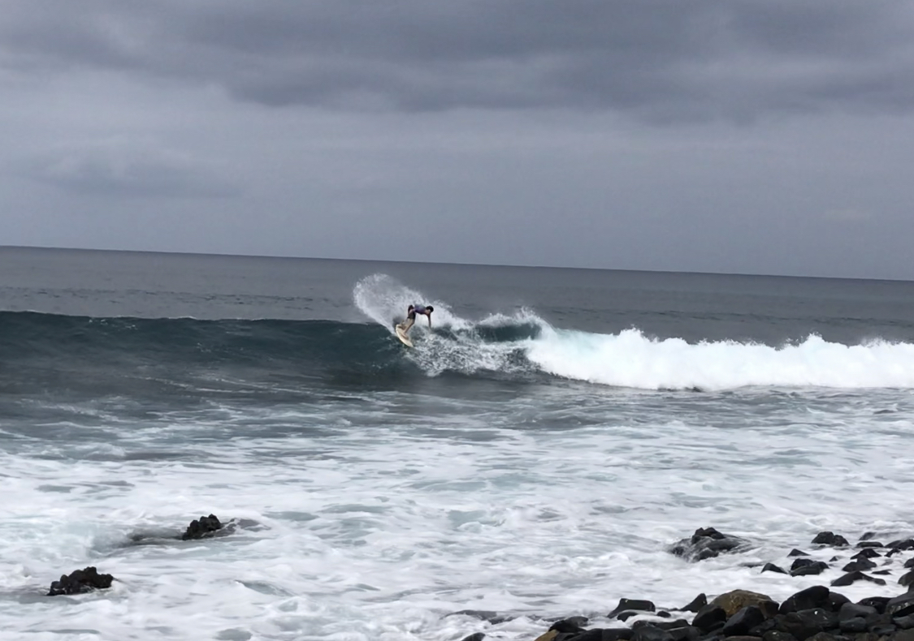
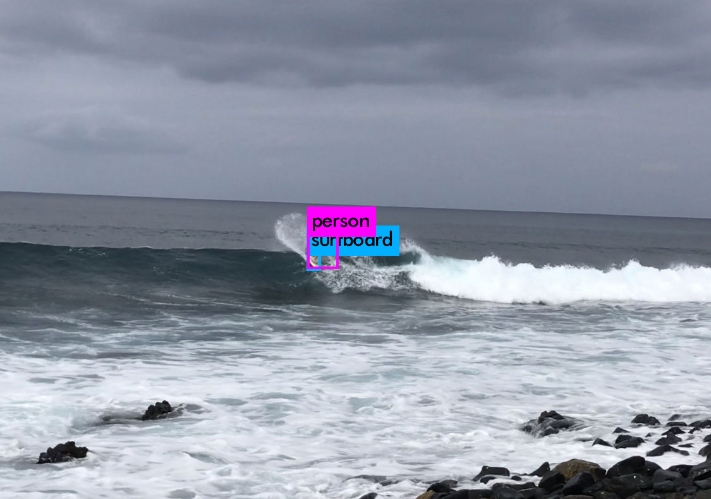
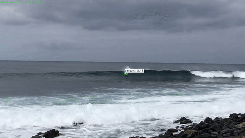
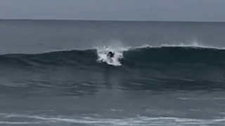

# surf-cam
Embedded computer vision surf tracking camera, OpenCV on NVIDIA Jetson Nano and streaming with FFmpeg (Wi-Fi and LTE)

<p align="center">
  
   
</p>

<p align="center">
  
  
</p>

## TODO

## Pre-requisits

### CUDA

https://developer.nvidia.com/cuda-downloads


```
wget https://developer.download.nvidia.com/compute/cuda/repos/ubuntu1804/x86_64/cuda-ubuntu1804.pinsudo mv cuda-ubuntu1804.pin /etc/apt/preferences.d/cuda-repository-pin-600wget https://developer.download.nvidia.com/compute/cuda/11.8.0/local_installers/cuda-repo-ubuntu1804-11-8-local_11.8.0-520.61.05-1_amd64.debsudo dpkg -i cuda-repo-ubuntu1804-11-8-local_11.8.0-520.61.05-1_amd64.debsudo cp /var/cuda-repo-ubuntu1804-11-8-local/cuda-*-keyring.gpg /usr/share/keyrings/sudo apt-get updatesudo apt-get -y install cuda
```

### OpenCV 4.6.0

https://docs.opencv.org/4.6.0/d7/d9f/tutorial_linux_install.html

```
# Install minimal prerequisites (Ubuntu 18.04 as reference)
sudo apt update && sudo apt install -y cmake g++ wget unzip
# Download and unpack sources
wget -O opencv.zip https://github.com/opencv/opencv/archive/4.6.0.zip
wget -O opencv_contrib.zip https://github.com/opencv/opencv_contrib/archive/4.6.0.zip
unzip opencv.zip
unzip opencv_contrib.zip
# Create build directory and switch into it
mkdir -p build && cd build
# Configure
cmake -DOPENCV_EXTRA_MODULES_PATH=../opencv_contrib-4.6.0/modules ../opencv-4.6.0
# Build
cmake --build .
```

## Known issues & improvements

## draftbook

https://docs.opencv.org/4.x/d8/d19/tutorial_stitcher.html

## Credits
